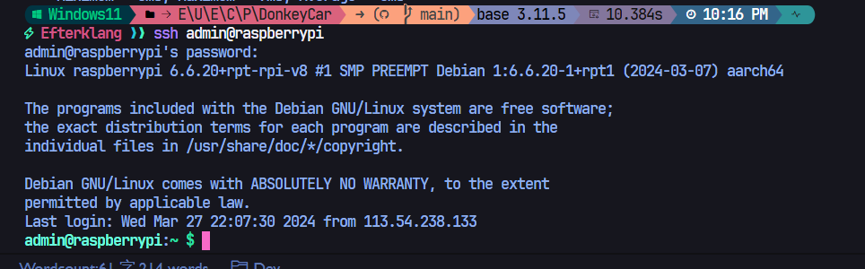
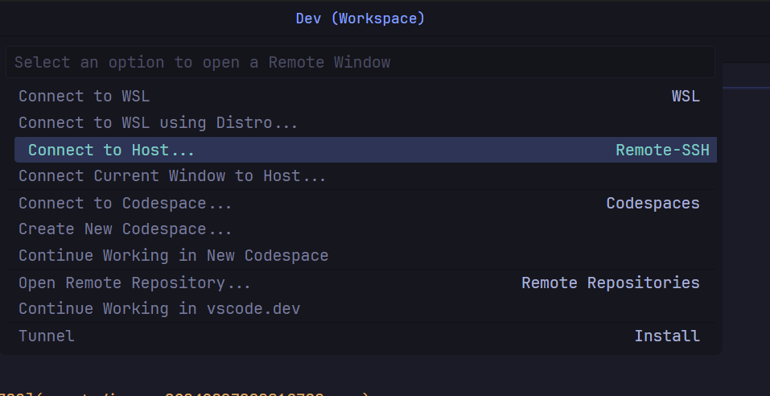
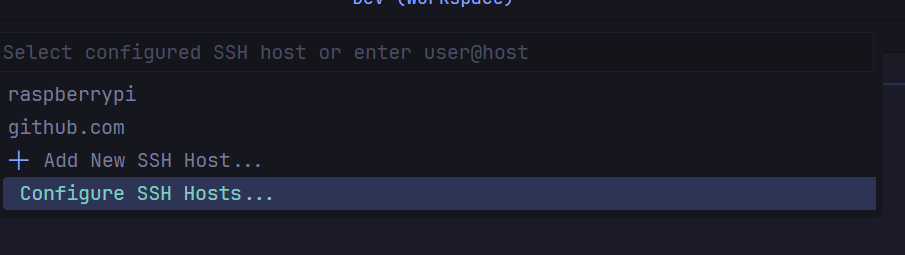
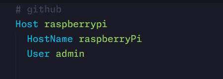

## 下载系统

下载Raspberry Pi Imager,在EDIT SETTINGS中开启SSH Service,保存后点击继续;软件会自动完成镜像的下载和验证


## SSH

将开发机器与树莓派连接在同一局域网中,然后可用ssh连接树莓派进行远程开发`ssh username@hostname`

```shell
ssh admin@raspberrypi
```



VSCode连接,下载remote-ssh插件

`Ctrl+Shift+P`打开命令面板,选择Connect to Host-Configure SSH Hosts





