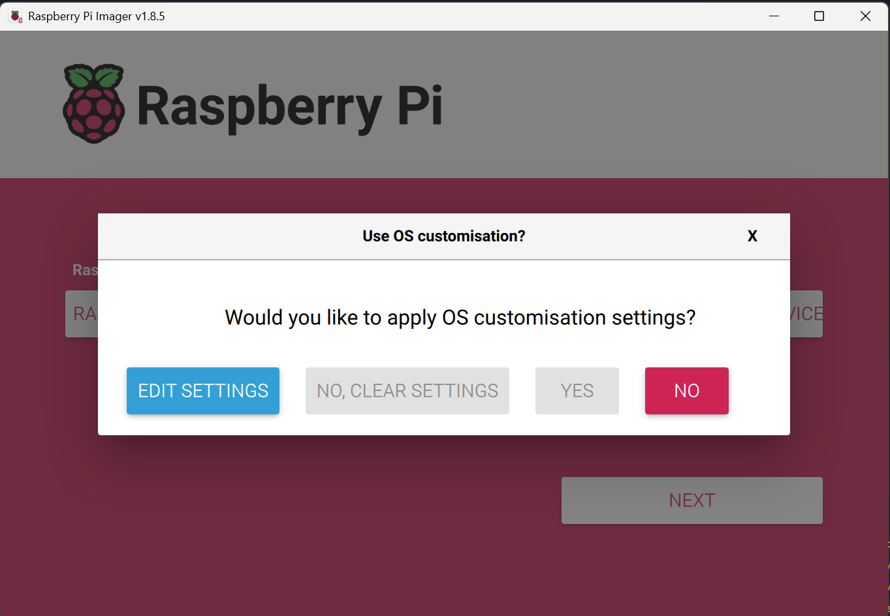
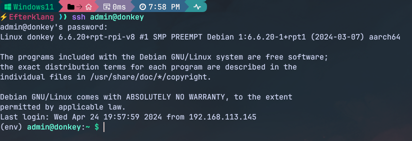
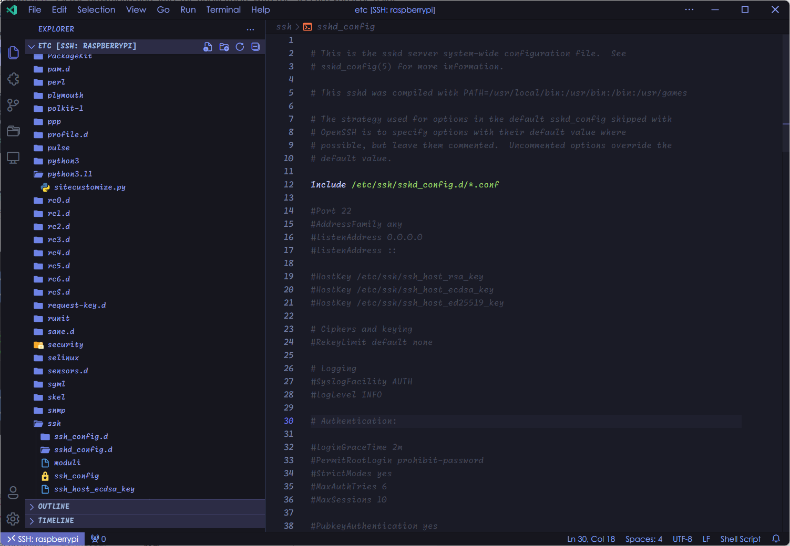

## 系统的安装

    首先，下载需要的OS镜像，我们选择Raspberry Pi OS(64 bit)；然后通过图形安装程序Raspberry Pi Imager安装系统。将用于RaspberryPi的SD卡插入计算机的SD卡读卡器，然后修改部分系统设置后开始烧录。

    修改的系统设置包括

**GENERAL**

* `hostname` donkey
* `username` admin
* `password` 123456
* `Configure wireless LAN`  设置初始链接的局域网
  * SSID: aaaa 热点名
  * Pwd: 热点密码

**SERVICES**

* 开启SSH服务



修改后点击NEXT，程序会自动将镜像写入SD卡并验证

## SSH服务

SSH 允许远程登录并控制服务器或其他计算机，且 提供了 SCP 和 SFTP这两个安全的文件传输协议用来在本地和远程系统之间安全地复制文件。为开发带来便利。

将开发机将开发机器与树莓派连接在同一局域网中，然后可用ssh连接树莓派进行远程开发 `ssh username@hostname`



项目使用VSCode作为开发工具，下载插件Remote-SSH通过Connect to Host-Configure SSH Hosts命令连接主机




### SSH免密登陆

#### Client设置

执行 `ssh-keygen` ，windows下打开 `%USERPROFILE%/.ssh/id_rsa.pub`，复制公钥内容

#### Server sshd设置

修改树莓派 `/etc/ssh/sshd_config`文件，设置

```
RSAAuthentication yes
PubkeyAuthentication yes
```

执行ssh-keygen，修改权限

```
chmod 700 ~/.ssh
chmod 600 ~/.ssh/authorized_keys
```


然后客户端输入 `ssh root@donkey`即可，不必再输入密码
